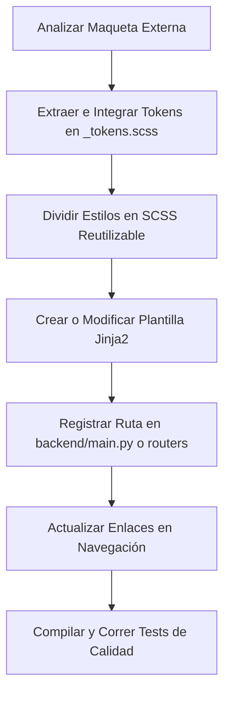

# Guía de Desarrollo Visual y Adaptación de Plantillas HTML

Esta guía está diseñada para desarrolladores que necesiten crear, modificar o adaptar interfaces visuales a partir de maquetas o prototipos HTML externos en el proyecto **Nicho Landing Factory & CRM**. 

El objetivo es comprender la arquitectura desacoplada, la compilación de estilos SCSS, el ruteo en FastAPI y la herencia de plantillas Jinja2 para trabajar de manera ordenada y segura, evitando romper la lógica de negocio.

---

## 1. Arquitectura del Proyecto de un Vistazo

El proyecto está dividido en dos grandes carpetas en la raíz para separar la lógica de backend del diseño de interfaz:

```text
landing_factory/
├── backend/                  # LÓGICA PYTHON (FastAPI)
│   ├── main.py               # Punto de entrada de la aplicación y montaje estático
│   ├── core/
│   │   ├── config.py         # Variables de entorno y configuración
│   │   └── database.py       # Conexión SQLAlchemy (PostgreSQL / SQLite)
│   ├── models/
│   │   ├── prospect.py       # Modelo ORM ProspectoB2BModel
│   │   └── schemas.py        # Esquemas DTO Pydantic
│   ├── services/
│   │   ├── generator.py      # Motor de inferencia por rubro y generación de demos
│   │   └── prospect_repository.py # Capa CRUD de base de datos
│   └── routers/              # Controladores delgados HTTP
├── frontend/                 # INTERFAZ Y ESTILOS (HTML / SCSS / JS)
│   ├── css/                  # CSS COMPILADO (¡No editar manualmente!)
│   │   └── main.css
│   ├── scss/                 # Código fuente de estilos (Sass)
│   │   ├── _tokens.scss      # Colores, tipografías y sombras
│   │   ├── _base.scss        # Reglas básicas y resets
      ├── _layout.scss      # Estructura (Header, Footer, Grid)
│   │   ├── _components.scss  # Botones, tarjetas, formularios
│   │   ├── _animations.scss  # Animaciones y transiciones 60fps
│   │   └── main.scss         # Punto de compilación de Sass
│   ├── templates/            # Plantillas Jinja2 (HTML desglosado)
│   │   ├── base.html         # Cascarón global
│   │   ├── index.html        # CRM Dashboard Standalone (React + Jinja2)
│   │   └── partials/         # Fragmentos repetitivos (header, footer)
│   └── demos/                # HTMLs estáticos de demos generadas
├── package.json              # Scripts de compilación de Sass
├── requirements.txt          # Dependencias de Python
└── tests/                    # Pruebas automatizadas (unittest)
```

---

## 2. Cómo se Relacionan Backend y Frontend

### A. El Montaje de Archivos Estáticos
En [backend/main.py](file:///c:/dev/kiosquito%20pags/backend/main.py) se monta la carpeta `/frontend` bajo la ruta URL `/static`:
```python
app.mount("/static", StaticFiles(directory="frontend"), name="static")
```
Esto significa que en tus archivos HTML, cualquier referencia a `/static/` buscará físicamente dentro de la carpeta `frontend/`. Por ejemplo:
* `frontend/css/main.css` se carga como `/static/css/main.css`.
* `frontend/demos/pyme_001.html` se sirve bajo `/static/demos/pyme_001.html`.

### B. El Renderizador de Plantillas Jinja2
En [backend/main.py](file:///c:/dev/kiosquito%20pags/backend/main.py) se define el directorio de plantillas en `frontend/templates`. Los endpoints de FastAPI toman estas plantillas y las sirven inyectando contexto.

---

## 3. Flujo de Trabajo: Cómo Adaptar una Plantilla HTML Externa

Cuando recibes un archivo de diseño o maquetas externas, **NUNCA** debes copiar y pegar el archivo completo. Debes seguir este proceso ordenado:



### Paso 1: Analizar e Identificar Elementos Clave
Antes de escribir código, abre la maqueta externa y responde a esto:
* ¿Qué tipografías usa? (¿Están cargadas en `base.html` o `index.html`?).
* ¿Cuáles son sus colores y sombras? (Variables a definir).
* ¿Qué partes se repiten? (Deberían ser partials o componentes).
* ¿Qué lógica interactiva de JavaScript contiene?

### Paso 2: Configurar los Tokens de Diseño (`_tokens.scss`)
Abre [frontend/scss/_tokens.scss](file:///c:/dev/kiosquito%20pags/frontend/scss/_tokens.scss). Si el prototipo tiene colores nuevos, agrégalos como variables o propiedades CSS en `:root`:
```scss
:root {
  --color-primary: #6366f1;
  --color-primary-hover: #4f46e5;
  --color-secondary: #06b6d4;
  --color-accent: #10b981;
  --color-bg-dark: #0f172a;
  
  --font-family-base: 'Plus Jakarta Sans', sans-serif;
}
```

### Paso 3: Modularizar y Escribir el SCSS
Divide el bloque de CSS embebido o el stylesheet del prototipo en los archivos correspondientes:
1. **Componentes (`_components.scss`)**: Botones (`.btn`), tarjetas (`.glass-card`), formularios, inputs.
2. **Estructura (`_layout.scss`)**: Rediseño del header (`.glass-nav`), pie de página y rejillas globales.
3. **Animaciones (`_animations.scss`)**: Transiciones suaves a 60 FPS.

> [!IMPORTANT]
> **Prohibido Editar `frontend/css/main.css`**: Este archivo es autogenerado. Si realizas cambios en él, se borrarán la próxima vez que compiles. Siempre debes modificar los archivos `.scss` en `frontend/scss/`.

Para compilar tus cambios de Sass a CSS real, ejecuta en tu terminal:
```bash
npm run build:css
```
Si deseas que el compilador escuche tus cambios y los aplique en tiempo real mientras editas, ejecuta:
```bash
npm run watch:css
```

### Paso 4: Construir la Plantilla Jinja2
Las páginas del sitio heredan del archivo base común [frontend/templates/base.html](file:///c:/dev/kiosquito%20pags/frontend/templates/base.html) que ya contiene el `<head>`, la inclusión de estilos, la barra de navegación y el footer.

Ejemplo de vista modular:
```html


Título de la Página | Nicho Landing Factory


<section class="home-section">
    <div class="container">
        <!-- Contenido principal extraído de la maqueta -->
    </div>
</section>

```

### Paso 5: Registrar la Ruta en FastAPI
Una vez que el archivo HTML existe en `frontend/templates/`, avísale a Python para que lo sirva al usuario.
Abre [backend/main.py](file:///c:/dev/kiosquito%20pags/backend/main.py) y agrega la función decorada con `@app.get`:
```python
@app.get("/nueva-vista", response_class=HTMLResponse)
async def nueva_vista(request: Request):
    return templates.TemplateResponse("nueva_vista.html", {"request": request})
```

### Paso 6: Validar la Calidad del Código (Testing)
Nunca envíes un cambio a producción sin validar que el servidor inicie correctamente y que todas las rutas respondan.

1. Asegúrate de que no haya errores de compilación SCSS (`npm run build:css`).
2. Ejecuta las pruebas automatizadas en tu terminal usando el entorno virtual:
   ```bash
   ./venv/bin/python -m unittest discover tests
   ```

---

## 4. Reglas de Oro del Desarrollador (Checklist de Seguridad Emayon Forge)

- [ ] **Herencia Estricta**: ¿Tu HTML comienza con ``? No incluyas etiquetas `<html>`, `<head>` o `<body>` duplicadas en las páginas hijas.
- [ ] **Variables de Tokens**: ¿Utilizaste variables de `_tokens.scss` para los nuevos colores? Evita hardcodear colores hexadecimales directos en el SCSS.
- [ ] **No usar CSS Embebido**: ¿Removiste todas las etiquetas `<style>` innecesarias dentro de tu HTML y las llevaste al SCSS correspondiente?
- [ ] **Rutas Absolutas en Menús**: Asegúrate de utilizar rutas absolutas como `href="/admin/dashboard"` para que la navegación funcione desde cualquier ubicación.
- [ ] **Manejo de JavaScript**: No pegues scripts dinámicos embebidos en el HTML si no son necesarios. Mantenlos modulares en `frontend/js/main.js` o componentes React encajonados.
- [ ] **Tests al Día**: ¿Agregaste el caso de test en `tests/` y ejecutaste `unittest` exitosamente?
